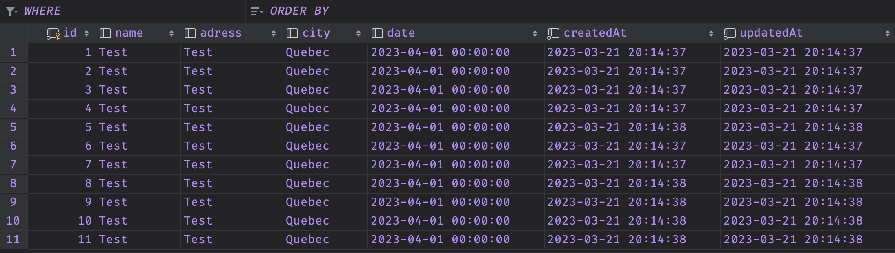

# Documentation


This is a documentation file including code for a server and client side of a web application. The server-side code includes configurations for the database, models for the database tables, and routes and controllers for the server. The client-side code includes the routing for the web application along with the code for displaying the app's header and sidebar.

The server-side code is written in Node.js using the Sequelize ORM to interact with the MySQL database. The client-side code is written in Vue.js.

The server-side code defines the configuration file for the database and models for the "products" and "checkout" tables. It also defines the routes and controllers for the "checkout" table.

The client-side code defines the routing for the web application and the components for displaying the header and sidebar. It also includes code for interacting with the server-side API for retrieving product data and user authentication.

The code above is not complete and may be missing some parts. It is intended as an example only.

# ***Part 1 : Server side***

# ./server/app/config/db.config.js

```jsx
module.exports = {
    HOST: '***box.toxicsed.fr***',
    PORT:'***49158***',
    USER: '***root***',
    PASSWORD: '***123Soleil***',
    DB: 'db_product',
    dialect: 'mysql'
}
```

# ./server/app/model/index.js

```jsx
const dbConfig = require('../config/db.config.js')
const Sequelize = require('sequelize')
const connex = new Sequelize(dbConfig.DB, dbConfig.USER, dbConfig.PASSWORD, {
    host:dbConfig.HOST,
    dialect:dbConfig.dialect,
    port: ***49158***,
    operatorAliases: false
})
const db = {}
db.Sequelize = Sequelize
db.connex = connex
db.products = require('./product.model.js')(connex, Sequelize)
db.checkout = require('./checkout.model.js')(connex, Sequelize)
db.users = require('./user.model.js')(connex, Sequelize)
module.exports = db
```

# ./server/app/model/checkout.model.js

```jsx
module.exports = (connex, Sequelize) => {
  const checkout = connex.define("checkout", {
    name: {
      type: Sequelize.STRING,
    },
    adress: {
      type: Sequelize.STRING,
    },
    city: {
      type: Sequelize.STRING,
    },
    date: {
      type: Sequelize.DATE,
    },
  });
  return checkout;
};
```

# ./server/app/controller/checkout.controller.js

```jsx
const db = require("../models");
const CheckOut = db.checkout;
const OP = db.Sequelize.Op;

exports.findAll = (req, res) => {
  CheckOut.findAll().then((data) => {
    res.send(data);
  });
};

exports.create = (req, res) => {
  console.log(req.body)
  CheckOut.create(req.body)
    .then((data) => {
      res.send(data);
    })
    .catch((e) => {
      res.status(500).send({
        message: "Could not insert into the table",
      });
    });
};

exports.findOne = (req, res) => {
  const id = req.params.id;
  CheckOut.findByPk(id)
    .then((data) => {
      res.send(data);
    })
    .catch((e) => {
      res.status(500).send({
        message: "Could not find the data",
      });
    });
};

exports.delete = (req, res) => {
  const id = req.params.id;
  CheckOut.destroy({
    where: { id: id },
  })
    .then((num) => {
      if (num == 1) {
        res.send({
          message: "CheckOut was deleted",
        });
      } else {
        res.send({
          message: "Could not delete",
        });
      }
    })
    .catch((e) => {
      res.status(500).send({
        message: "Database error",
      });
    });
};

exports.update = (req, res) => {
  const id = req.params.id;
  CheckOut.update(req.body, {
    where: { id: id },
  })
    .then((num) => {
      if (num == 1) {
        res.send({
          message: "CheckOut was updatedd",
        });
      } else {
        res.send({
          message: "Could not update",
        });
      }
    })
    .catch((e) => {
      res.status(500).send({
        message: "Database error",
      });
    });
};
```

# ./server/app/routes/checkout.route.js

```jsx
module.exports = app => {
    const checkout = require('../controllers/checkout.controller.js')
    const router = require('express').Router()

    router.post('/', checkout.create)
    
    router.get('/', checkout.findAll)

    app.use('/api/checkout', router)
}
```

# ***Part 2 : Client Side***

# ./vue-client/src/router/index.js

```jsx
import { createRouter, createWebHistory } from 'vue-router'
import HomeView from '../views/HomeView.vue'
import AboutView from '../views/AboutView.vue'
import NewProductView from '../views/NewProductView.vue'
import ProductView from '@/views/ProductView.vue'
import ProductEditView from '@/views/ProductEditView.vue'
import UserView from '@/views/UserView.vue'
import LoginView from '@/views/LoginView.vue'
import CheckoutView from '@/views/CheckOut.vue'

const routes = [
  {
    path: '/',
    name: 'home',
    component: HomeView
  },
  {
    path: '/about',
    name: 'about',
    component: AboutView
    // route level code-splitting
    // this generates a separate chunk (about.[hash].js) for this route
    // which is lazy-loaded when the route is visited.
    // component: () => import(/* webpackChunkName: "about" */ '../views/AboutView.vue')
  },
  {
    path: '/new-product',
    name: 'new-product',
    component: NewProductView,
    meta: {
      isAuth: true
    }
  },
  {
    path: '/product/:id',
    name: 'product',
    component: ProductView
  },
  {
    path: '/product-edit/:id',
    name: 'product-edit',
    component: ProductEditView
  },
  {
    path: '/user',
    name: 'user',
    component: UserView
  },
  {
    path: '/login',
    name: 'login',
    component: LoginView
  },
  {
    path: '/checkout',
    name: 'checkout',
    component: CheckoutView
  }
]

const router = createRouter({
  history: createWebHistory(process.env.BASE_URL),
  routes
})

export default router
```

# ./vue-client/src/views/App.vue

```jsx
<template>
    <!-- Navigation-->
    <nav class="navbar navbar-expand-lg navbar-light bg-light">
        <div class="container px-4 px-lg-5">
            <span class="navbar-brand" v-if="user"> Hi {{ user.fullname}}</span>
            <button class="navbar-toggler" type="button" data-bs-toggle="collapse" data-bs-target="#navbarSupportedContent" 
aria-controls="navbarSupportedContent" aria-expanded="false" aria-label="Toggle navigation">
<span class="navbar-toggler-icon"></span></button>
            <div class="collapse navbar-collapse" id="navbarSupportedContent">
                <ul class="navbar-nav me-auto mb-2 mb-lg-0 ms-lg-4">
                    <li class="nav-item"><router-link class="nav-link active" aria-current="page" to="/">Home</router-link></li>
                    <li class="nav-item"><router-link class="nav-link" to="/about">About</router-link></li>
                    <li class="nav-item " v-if="user"><router-link class="nav-link" to="/new-product">New Product</router-link></li>
                    <li class="nav-item " v-if="!user"><router-link class="nav-link" to="/user">Register</router-link></li>
                    <li class="nav-item " v-if="!user"><router-link class="nav-link" to="/login">Login</router-link></li>
                    ***<li class="nav-item " v-if="user"><router-link class="nav-link" to="/checkout">Checkout</router-link></li>***
                    <li class="nav-item " v-if="user"><span class="nav-link" @click="logout" style="cursor:pointer">Logout</span></li>

                </ul>
                <form class="d-flex">
                    <button class="btn btn-outline-dark" type="button" v-on:click="toggleSideBar">
                        <i class="bi-cart-fill me-1"></i>
                        Cart
                        <span class="badge bg-dark text-white ms-1 rounded-pill"> {{ totalQuantity }}</span>
                    </button>
                </form>
            </div>
        </div>
    </nav>
    <!-- Header-->
    <header class="bg-dark py-5">
        <div class="container px-4 px-lg-5 my-5">
            <div class="text-center text-white">
                <h1 class="display-4 fw-bolder">Shop in style</h1>
                <p class="lead fw-normal text-white-50 mb-0">With this shop hompeage template</p>
            </div>
        </div>
    </header>
  <router-view
  :inventory = "inventory"
  :addToCart = "addToCart"
  :addInv = "addInventory"
  :user = "user"
  :removeInv = "removeInventory"
  :remove = "removeItem"
  :updateInv = "updateInventory"
  />
  <Sidebar
  v-if="showSideBar"
  :toggle = "toggleSideBar"
  :cart = "cart"
  :inventory = "inventory"
  :remove = "removeItem"
  />
</template>

<script>
import Sidebar from './components/SideBar.vue'
import ProductDataService from '@/services/ProductDataService'
import UserDataService from '@/services/UserDataService'
import { mapGetters } from 'vuex'

export default {
  components: {
    Sidebar
  },
  data () {
    return {
      showSideBar: false,
      inventory: [],
      cart: {}
    }
  },
  methods: {
    toggleSideBar () {
      this.showSideBar = !this.showSideBar
    },
    addToCart (product, index) {
      if (!this.cart[product]) this.cart[product] = 0
      this.cart[product] += this.inventory[index].quantity
      console.log(this.cart[product])
    },
    removeItem (name) {
      delete this.cart[name]
    },
    addInventory (data) {
      this.inventory.push(data)
    },
    removeInventory (index) {
      this.inventory.splice(index, 1)
    },
    updateInventory (index, data) {
      this.inventory[index].name = data.name
      this.inventory[index].photo = data.photo
      this.inventory[index].price = data.price
      this.inventory[index].description = data.description
      this.inventory[index].tyoe = data.type
    },
    logout () {
      UserDataService.getLogout()
        .then(response => {
          localStorage.removeItem('token')
          this.$store.dispatch('user', null)
          this.$router.push('login')
        })
    }
  },
  computed: {
    totalQuantity () {
      return Object.values(this.cart).reduce((acc, curr) => {
        return acc + curr
      }, 0)
    },
    ...mapGetters(['user'])
  },
  mounted () {
    ProductDataService.getAll()
      .then(response => {
        this.inventory = response.data
      })
  },
  created () {
    UserDataService.getAuth()
      .then(response => {
        this.name = response.data.fullname
        this.$store.dispatch('user', response.data)
      })
      .catch(e => {
        this.$store.dispatch('user', null)
      })
  }
}
</script>
```

# ./vue-client/src/view/CheckOut.vue

```jsx
<template>
    <div class="container">
        <div class="row justify-content-center mt-5">
            <div class="col-md-6">
                <div v-if="message != '' " class="alert alert-danger">{{ message }}</div>
                <h4 class="mb-3">Checkout</h4>
                <div>
                    <div class="form-group">
                        <label for="date">Date</label>
                        <input v-model="date" type="date" class="form-control mb-3" id="date">
                    </div>
                    <div class="form-group">
                        <label for="fullname">Name</label>
                        <input v-model="fullname" type="text" class="form-control mb-3" id="fullname" placeholder="Enter name">
                    </div>
                    <div class="form-group">
                        <label for="address">Address</label>
                        <input v-model="address"  type="text" class="form-control mb-3" id="address" placeholder="Enter Address">
                    </div>
                    <div class="form-group">
                        <label for="city">City</label>
                        <select v-model="city" class="form-control mb-3" id="city">
                            <option value="">Select</option>
                            <option value="Montreal">Montreal</option>
                            <option value="Quebec">Quebec</option>
                            <option value="Toronto">Toronto</option>
                        </select>
                    </div>
                    <button @click="save" class="w-100 btn btn-secondary btn-lg mt-3 mb-3" type="button">Save </button>
                </div>
                <div>
                    <div v-if="alert != false " class="alert alert-success alert-dismissible fade show" role="alert">
                        <strong> Your order is being processed. Thank you !</strong>
                        <button type="button" class="btn-close" data-bs-dismiss="alert" aria-label="Close"></button>
                    </div>
                </div>
                <hr class="my-4">
            </div>
        </div>
    </div>
</template>

<script>
import CheckOutDataService from '@/services/CheckOutDataService'
export default {
  name: 'CheckOut',
  data () {
    return {
      date: '',
      fullname: '',
      address: '',
      city: '',
      message: '',
      alert: false
    }
  },
  methods: {
    save () {
      if (this.date === '' || this.fullname === '' || this.address === '' || this.city === '') {
        this.message = 'Please fill all fields'
      } else {
        this.message = ''
        this.alert = true
        CheckOutDataService.create({
          date: this.date,
          name: this.fullname,
          adress: this.address,
          city: this.city
        })
      }
    }
  }
}
</script>
```

# ./vue-client/src/components/SideBar.vue

```jsx
<template>
    <aside class="cart-container">
        <div class="cart">
            <h1 class="cart-title spread">
            <span>
                Cart
                <i class="bi-cart-fill me-1"></i>
            </span>
            <button class="cart-close" @click="toggle">&times;</button>
            </h1>
            <div class="cart-body">
            <table class="cart-table">
                <thead>
                <tr>
                    <th><span class="sr-only">Product Image</span></th>
                    <th>Product</th>
                    <th>Price</th>
                    <th>Qty</th>
                    <th>Total</th>
                    <th><span class="sr-only">Actions</span></th>
                </tr>
                </thead>
                <tbody>
                <tr v-for="(quantity, key, i) in cart" :key="i">
                    <td></td>
                    <td>{{ key }}</td>
                    <td>${{ getPrice(key) }}</td>
                    <td class="center">{{ quantity }}</td>
                    <td>${{ (quantity*getPrice(key)).toFixed(2)}}</td>
                    <td class="center">
                    <button class="btn btn-light cart-remove" @click="remove(key)">
                        &times;
                    </button>
                    </td>
                </tr>
                </tbody>
            </table>
            <p class="center" v-if="!Object.keys(cart).length"><em>No items in cart</em></p>
            <div class="spread">
                <span><strong>Total:</strong> ${{ calculateTotal() }}</span>
                <button @click="checkout" class="btn btn-light">Checkout</button>
            </div>
            </div>
        </div>
    </aside>
</template>

<script>
export default {
  props: ['toggle', 'cart', 'inventory', 'remove'],
  data () {
    return {
      publicPath: window.location.origin
    }
  },
  methods: {
    getPrice (name) {
      const product = this.inventory.find((p) => {
        return p.name === name
      })
      return product.price.toFixed(2)
    },
    getPhoto (name) {
      const product = this.inventory.find((p) => {
        return p.name === name
      })
      return product.photo
    },
    calculateTotal () {
      const total = Object.entries(this.cart).reduce((acc, curr) => { return acc + (curr[1] * this.getPrice(curr[0])) }, 0)
      return total.toFixed(2)
    },
    checkout () {
      this.$store.dispatch('checkout', this.cart)
      this.$router.push('/checkout')
    }
  }
}
</script>
```

# **Database Output**



[GitHub - Mr-R-b0t/reimagined-rotary-phone](https://github.com/Mr-R-b0t/reimagined-rotary-phone.git)
